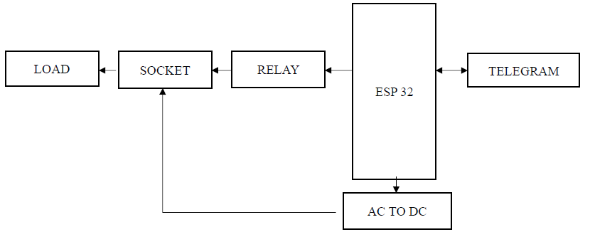
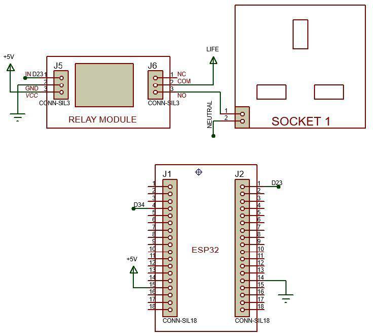
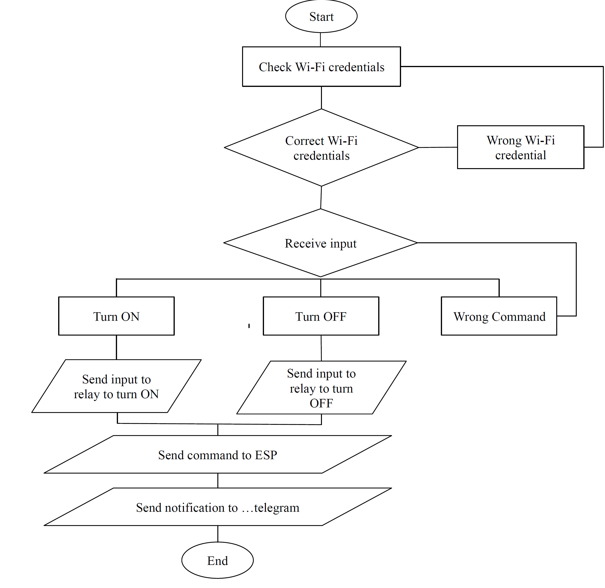

# IoT Smart Socket with Telegram Automation

## Overview
This project is an Internet of Things (IoT) smart socket designed to automate home appliances, mitigate "vampire power" consumption, and prevent electrical fires. Powered by an **ESP32 microcontroller**, the system connects to local Wi-Fi and is controlled remotely from anywhere in the world using the **Telegram messaging app**.

## Technology Stack
* **Microcontroller:** NodeMCU ESP32 (Integrated Wi-Fi & Bluetooth)
* **Power Electronics:** 5V Relay Module, AC-to-DC Converter (220V AC to 5V DC)
* **Software/Language:** C/C++ (Arduino IDE)
* **APIs & Libraries:** `WiFiClientSecure.h`, `UniversalTelegramBot.h`, `ArduinoJson.h`

## How It Works
1. **Network Connection:** The ESP32 authenticates and connects to the local Wi-Fi network.
2. **Cloud Polling:** Using the Universal Telegram Bot API, the ESP32 continuously polls the Telegram servers via secure HTTPS for new messages.
3. **Command Execution:** * When the user sends `/socketon`, the ESP32 drives the digital output LOW, closing the 5V relay and powering the appliance. It then returns a "SOCKET ACTIVE" confirmation to the chat.
   * When `/socketoff` is sent, the output goes HIGH, opening the relay and confirming "SOCKET DEACTIVE".

## System Architecture

### Hardware Block Diagram

### Circuit Schematic

### Software Logic & Flowchart

### User Interface (Telegram Bot)

